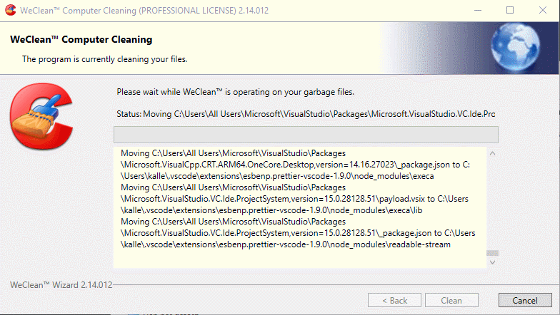

# WeClean&trade; prank virus

This product is a simple fake virus aimed to be used
as a prank for your coworkers.
It's visual design is highly inspired by popular
malicious-looking tools.

It's just a very simple [WPF ![external link icon][ico-external-link-14]](https://docs.microsoft.com/en-us/visualstudio/designers/introduction-to-wpf?view=vs-2019) application :)
Preview:

## Installation

No installation needed. It's just a .NET Framework application. That said it only works on Windows. :(
It does however require the correct .NET Framework version to be installed.

| Prerequisite       | MSIL\*                                               |
| ------------------ | ---------------------------------------------------- |
| .NET Framework 4.7 | [Download ![download icon][ico-download-14]][dl-4.7] |

Make a new [issue][issues]
if more versions are needed and I'll be on it.
Maybe even an OS X or Linux version?
_Who knows nowadays with .NET Core 3 and all._

Although, for now I only have a single release.

> \*MSIL = Microsoft Intermediate Language. It is a CPU/architecture- and platform-independent instruction set. Which means works on all platforms, no matter 32 or 64 bit.

## How it works

- It walks your drives in a _"haphazard"_ order just for displaying them in the log window.

- It refuses closing, except for force-close via ex: the [task manager ![external link icon][ico-external-link-14]](<https://en.wikipedia.org/wiki/Task_Manager_(Windows)>).

- It bypasses anti-virus programs, _because it's not doing anything harmful anyways._

And nothing else.

## Lol but it's not that well made

That's rude. I actually put a lot of effort into this, though only like 5 hours of effort. But still good effort ;) _Getting the looks just right was key and took the most effort._

So yes there will be some bad code because I had to make it in a rush so I got time left to install this on their computers before wednesday, mmmkay.

<!-- GITHUB LINKS -->

[issues]: https://github.com/jilleJr/WeClean/issues
[dl-4.7]: https://github.com/jilleJr/WeClean/releases/download/v2.14.012/WeClean.2.14.012.exe

<!-- RESOURCES -->

[ico-external-link-14]: docs/icons8-external-link-14.png
[ico-download-14]: docs/icons8-download-14.png
